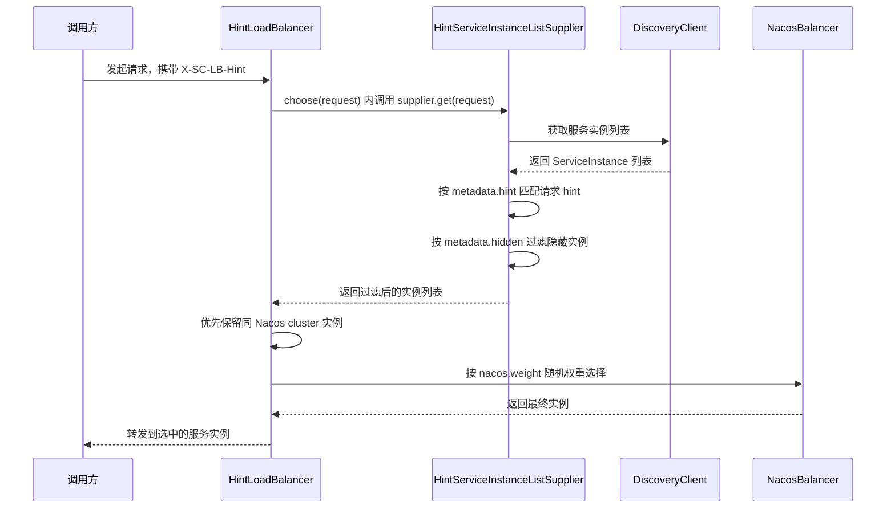

# HLB Hint LoadBalancer

`hlb` 是一个基于 Spring Cloud LoadBalancer 和 Nacos 的轻量扩展，主要解决两类问题：

1. 按请求 `hint` 定向选实例。
2. 按实例元数据 `hidden` 过滤隐藏实例。

它保留了 Nacos 原有的集群优先和权重随机选择能力，同时把 hint 路由接入到 Spring Cloud
LoadBalancer 的请求链路中，整体处理保持响应式，不额外引入阻塞调用。

## 工作原理

核心流程是：负载均衡器接收带上下文的 `Request`，把请求继续传给实例列表供应器，由供应器根据
`hint` 和 `hidden` 先收窄实例集合，最后再交给 Nacos 原有的权重逻辑选择一个实例。



这里最关键的是 `HintLoadBalancer` 调用的是 `supplier.get(request)`，而不是普通的 `supplier.get()`。
只有把 `Request` 传下去，Spring Cloud LoadBalancer 才能从请求头或 `HintRequestContext` 中读取 hint。

实例过滤分两步完成：

1. 先复用 Spring 原生 `HintBasedServiceInstanceListSupplier` 的 hint 过滤能力。请求 hint 会和实例
   metadata 中的 `hint` 做精确匹配；如果没有 hint 或没有命中，按 Spring 原生策略返回原始实例列表。
2. 再执行本项目增加的 `hidden` 过滤。实例 metadata 中 `hidden=true` 时，会从候选列表中移除。

如果启用了 `zone-preference` 配置，实例列表会先经过 Spring Cloud LoadBalancer 的 zone 优先过滤，
再进入 hint 与 hidden 过滤。最终选择阶段仍然沿用 Nacos 的逻辑：同集群实例优先，随后按
`nacos.weight` 做随机权重选择。

上述过滤过程都是 `Flux<List<ServiceInstance>>` 上的 `map` 转换，只处理内存中的实例列表，不发起额外
网络调用，也不会主动阻塞线程。

## 启用方式

在应用中启用：

```yaml
spring:
  cloud:
    loadbalancer:
      hint:
        enabled: true
      nacos:
        enabled: false
```

nacos.enabled: false就是把nacos-discovery依赖中的NacosLoadBalancerClientConfiguration排除
同时确保已经接入 Nacos Discovery，并且 `hlb` 这个依赖已被引入。

## 请求 hint

默认使用的请求头是 Spring Cloud LoadBalancer 的 hint 头，默认值为：

```http
X-SC-LB-Hint
```

调用方只要在请求中带上这个 header，就可以触发 hint 路由。

示例：

```http
GET /orders/1
X-SC-LB-Hint:raphael 
```

## 实例元数据

### hint

实例元数据中的 `hint` 用于和请求 hint 做匹配。

### hidden

实例元数据中的 `hidden` 用于控制实例是否参与路由。

- `hidden: true` 表示隐藏，不参与最终选择。
- `hidden: false` 或不配置，表示可见。

### 示例

```yaml
spring:
  cloud:
    nacos:
      discovery:
        metadata:
          hint: raphael
          hidden: true
```
或者直接配置JVM参数：
```aiignore
-Dspring.cloud.nacos.discovery.metadata.hint=raphael
-Dspring.cloud.nacos.discovery.metadata.hidden=true
```

## 使用建议

- `hint` 适合灰度、功能分流、指定流量路由。
- `hidden` 适合临时下线、内部实例屏蔽、特殊实例隔离。
- 如果没有命中 hint，系统会回退到可用实例集合继续选择。
- 选择阶段仍然遵循 Nacos 的集群与权重规则。

## 兼容性

当前代码基于：

- Spring Boot 2.6.3
- Spring Cloud 3.1.1
- Spring Cloud Alibaba 2021.0.1.0
------
> 代码结构
> - `HintLoadBalancerAutoConfiguration`
>   - 自动装配入口。
> - `HintLoadBalancerClientConfiguration`
>   - 负载均衡客户端配置。
> - `HintLoadBalancer`
>   - 负责请求透传和最终实例选择。
> - `HintServiceInstanceListSupplier`
>   - 负责 hint 与 hidden 的实例过滤。
> - `HintConstant`
>   - 维护元数据常量。
> - `HintConditionalOnLoadBalancer`
>   - 开关注解。
